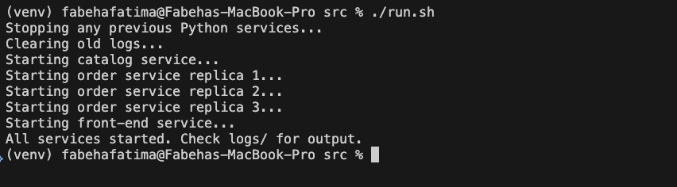
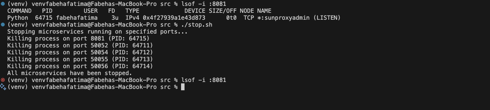

# Trade-Net Distributed Stock Exchange

## 💼 Project Overview

The Trade-Net Distributed Stock Exchange is a fault-tolerant, scalable trading platform designed to simulate a modern stock exchange system. Developed using microservices and cloud-native principles, Trade-Net supports real-time stock lookups, trade order placement, and robust failure handling.

This project includes:

* Efficient stock lookups with **in-memory LRU caching**
* Consistent order processing using **leader-follower replication**
* Crash resilience with **automatic failover and replica recovery**
* Seamless deployment on **AWS cloud infrastructure** (refer [Evaluation.md](docs/Evaluation.md) for deployment steps)
---

## 🧱 System Architecture

### Core Microservices:

1. **Frontend Service**

   * Exposes REST APIs for clients:

     * `GET /stocks/<stock_name>`
     * `POST /orders`
     * `GET /orders/<order_number>`
   * Manages cache and leader coordination.

2. **Catalog Service**

   * Stores stock data with initial volume = 100 units for each of the 10+ stocks.

3. **Order Service**

   * Runs in 3 replicas: 1 leader, 2 followers.
   * Handles trade/order processing and synchronization.

All services communicate over gRPC or REST and support concurrent requests.

---

## 🚀 Features

### ✅ Caching

* Frontend uses an **LRU cache** for stock lookups.
* Invalidated via server-push from the catalog on updates.
* Cache size is configurable and intentionally smaller than the stock set.

### ✅ Replication

* Three order service replicas run in parallel.
* **Leader is selected based on highest available ID.**
* Only the leader handles requests; followers sync after every successful order.

### ✅ Fault Tolerance

* Leader crash triggers automatic **re-election** by frontend.
* Recovered replicas pull missed orders from other replicas.
* Crash-recovery ensures **no data loss** and **continued availability**.

### ✅ Cloud Deployment & Evaluation

* All microservices run as **containers/processes on a single AWS EC2 instance**.
* Clients simulate trades from local machines.
* Performance evaluated for varying trade probabilities (`p` from 0 to 0.8).
* Latency plotted with and without caching.
* Crash recovery and **cache replacement behavior** (via LRU) tested and logged.

---


## Code Setup

We configured our system with the following microservices all are in `src/service` folder:

* A **front_end service** exposing REST APIs and managing request routing.
* A **catalog service** managing stock metadata.
* An **order service**, replicated across three instances (replica1, replica2, replica3) for fault tolerance.

The **front_end service** also integrates an **LRU cache** to reduce latency during repeated stock lookups. This cache is automatically invalidated on stock updates (buys/sells).


## Prerequisites
- python version >=3.8
- pip/pip3 version compatible with python (20 or higher)
  
```bash
cd src/service  
pip install -r requirements.txt
```


## Start bash Script
To start all services simultaneously, we use the provided startup script:

```bash
cd src  
./run.sh  
```

This script:

* Starts the catalog service on port `50052`
* Launches three order replicas on ports `50054`, `50055`, and `50056`
* Starts the frontend service on port `8081`

*Figure 1: Terminal output during service initialization*


---

## Stopping All Services

To cleanly shut down all running services, use the stop script:

```bash
cd src  
./stop.sh  
```

This script terminates:

* The frontend
* The catalog
* All three order replicas

*Figure 2: Terminal output after stopping services*



## 📁 Directory Structure

```
├── client/               # Client logic for testing trades
├── frontend/             # REST API + cache + leader coordination
├── catalog/              # Stock catalog service
├── order/                # Replicated order services            
├── docs/                 # Design, output, and evaluation documents
│   ├── design_doc.pdf
│   ├── output_screenshots.pdf
│   ├── evaluation.pdf
└── README.md
```

---

## 📊 Evaluation Summary

* **Latency vs p (0 to 0.8)**: Plots included in `evaluation.pdf`
* **Caching Results**: Up to 40% latency reduction with cache enabled
* **LRU Cache Behavior**: Demonstrated with replacement logs
* **Crash Recovery**: Transparent to clients; leader failover successful

---

## 📚 References

* [Flask Web Framework](https://flask.palletsprojects.com/en/2.2.x/)
* [Model-View-Controller (MVC)](https://en.wikipedia.org/wiki/Model–view–controller)
* [Asterix Universe](https://en.wikipedia.org/wiki/Asterix)

