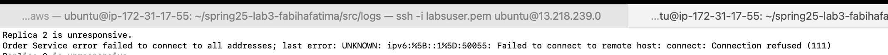
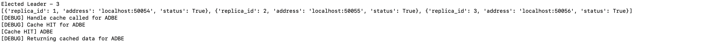

# Overview - Part 4 Testing & Setup

This README details how we deployed the Lab 3 project (Asterix and Double Trouble) on AWS using the AWS Academy Learner Lab environment.  And provides a detailed evaluation of the system performance, focusing on **average latency** across different operation types (`lookup`, `order_lookup`, `trade`) at varying trade probabilities (`p = 0.0`, `0.2`, `0.4`, `0.6`, `0.8`). The analysis is based on empirical data collected from client-side measurements during system stress testing.


## Steps for AWS Academy Learner Lab Setup

### 1. Launch the Learner Lab

* Go to AWS Academy Learner Lab via Canvas → Modules → Launch AWS Academy Learner Lab.
* Click **Start Lab**. Wait for the environment to initialize 

### 2. Retrieve Credentials and SSH Key

* Click **AWS Details** → Click **Show** under *AWS CLI*. Copy credentials.

* Save credentials to:

  * `~/.aws/credentials` (Linux/Mac)
 
* Click **Download PEM** under *SSH Key*, rename it to `labsuser.pem` and move it to your `.aws/` directory. Set proper permissions:

```bash
chmod 400 ~/.aws/labsuser.pem
```

### 3. Launch EC2 Instance

Run this from **local machine**:

```bash
aws ec2 run-instances \
  --image-id ami-0d73480446600f555 \
  --instance-type t2.medium \
  --key-name vockey \
  --security-groups default \
  --region us-east-1 > instance.json
```
Note: vockey is the key-name of default key in AWS Learner Library in our case
### 4. Authorize SSH Access

```bash
aws ec2 authorize-security-group-ingress \
  --group-name default \
  --protocol tcp \
  --port 22 \
  --cidr 0.0.0.0/0
```

### 5. SSH Into EC2

```bash
# From local machine:
ssh -i ~/.aws/labsuser.pem ubuntu@<YOUR_EC2_PUBLIC_DNS>
```

---

## Code Deployment and Execution

### 1. Transfer Code to EC2

From your local machine:

```bash
scp -i ~/.aws/labsuser.pem -r spring25-lab3-fabihafatima ubuntu@<EC2_PUBLIC_DNS>:~/
```

We can check **EC2_PUBLIC_DNS** in **instance.json** or use the command:
 ```bash
aws ec2 describe-instances \
  --instance-id <your-instance-id> \
  --query "Reservations[0].Instances[0].PublicDnsName" \
  --output text

```

### 2. Set Up Python Environment and Start Services

First, SSH into your EC2 instance and navigate to the service directory:

```bash
cd ~/spring25-lab3-fabihafatima/src/service
```

#### Check Python Version

```bash
python3 --version
```

If the version < 3.8, update Python and configure it:

```bash
sudo apt update
sudo apt install -y python3.8 python3.8-venv python3.8-distutils
sudo update-alternatives --install /usr/bin/python3 python3 /usr/bin/python3.8 1
```

Update `pip3` as well:

```bash
sudo apt install python3-pip
python3 -m pip install --upgrade pip
```

Check python version again if not  updated but installed still use:

```bash
sudo update-alternatives --install /usr/bin/python3 python3 /usr/bin/python3.8 1
sudo ln -sf /usr/local/bin/pip3.8 /usr/bin/pip3
---
```

#### Install Required Python Packages

Make sure you're still in the **`src/service`** directory, then install dependencies:

```bash
pip3 install -r requirements.txt
```

---

#### Start All Services

Switch to the main source directory and run the startup script:

```bash
cd ~/spring25-lab3-fabihafatima/src
chmod +x run.sh
./run.sh
```


This will start:

- **catalog** service on port `50052`
- **order replicas** on ports `50054`, `50055`, and `50056`
- **frontend** service on port `8081`

#### Stop All Services 
In order to kill all processes i.e. stop all services there is a bash script (will be handy for debugging):

```bash
cd ~/spring25-lab3-fabihafatima/src
./stop.sh
```

### 3. Run Tests from Local Machine calling to ec2

- Update the `FRONTEND_URL` in `client/client.py` with correct EC2_PUBLIC_DNS IP Address

- Then from local terminal:

```bash
pip3 install requests
python3 client/client.py
```

Running client for all p - 0.0 to 0.8:


---
## Average Latency

The `client/client.py` script is designed to test the performance of the stock trading system by simulating 5 concurrent clients, each sending requests to the system’s frontend (either locally or on AWS). Each client performs a series of operations — looking up stock information, placing trades, and checking the status of those trades — over 20 iterations. The decision to place a trade is controlled by a configurable probability value p, which allows testing how the system performs under different trade loads (e.g., p = 0.4 means 40% of the time a trade is attempted after a lookup). For every request, the script measures how long it takes (latency) and saves this data into CSV files inside the tests/output/ folder. This setup helps evaluate how well the system handles concurrent activity and whether features like caching are effectively improving response times.

The bar chart below summarizes the average latency (in seconds) for each type of operation at various trade probabilities with **cache enabled** (`ENABLE_CACHE = True` in front_end.py):


### Observations 
#### When Caching is enabled:
1. **Trade Operations**:  
   Trade requests consistently show the **highest latency**, especially as `p` increases. This is expected due to:
   - Higher synchronization cost across replicated order services.
   - Increased network and disk I/O from processing the trades.
   - Lock contention and cache invalidation overhead.

2. **Order Lookup**:  
   Latency for `order_lookup` is **moderate**, but still grows steadily with increasing `p`. This is because:
   - A higher trade probability means more transactions to lookup.
   - Reads often hit uncached data when replicas are recovering or catching up.

3. **Stock Lookup**:  
   The `lookup` operation is the fastest among the three, as it usually benefits from the caching layer on the frontend. However, its latency also increases with `p` due to:
   - More frequent invalidation of cached stock entries caused by updates.
   - Occasional frontend cache misses that require gRPC requests to catalog.

4. **Performance Trend**:
   - For all operations, latency grows with trade probability `p`.
   - This reflects the load impact from increased trading activity, which stresses the order service, cache management, and synchronization logic.
   - At `p = 0.8`, trade latency crosses **30 seconds** on average, highlighting potential bottlenecks for high-frequency workloads.


 #### Disable the cache (`ENABLE_CACHE = False`) :
 - Make ENABLE_CACHE = False in front_end.py code
 - Run client.py again - change log names to avoid overriding

Latency logs were stored separately and aggregated into CSV files for plotting and analysis.
Refer to [Tests for Cache Output EC2](../tests/output/cache-output-ec2) and [Tests for No Cache Output EC2](../tests/output/nocache-output-ec2) for all the latency value


#### Results Summary

| p-value | Query (Cache) | Query (No Cache) | Buy (Cache) | Buy (No Cache) |
|---------|----------------|------------------|-------------|----------------|
| 0.0     | 8.1 sec        | 13.2 sec         | 24.6 sec    | 71.0 sec       |
| 0.2     | 16.2 sec       | 36.5 sec         | 25.4 sec    | 62.3 sec       |
| 0.4     | 17.5 sec       | 60.5 sec         | 26.1 sec    | 53.6 sec       |
| 0.6     | 18.0 sec       | 62.1 sec         | 26.8 sec    | 55.1 sec       |
| 0.8     | 21.4 sec       | 70.3 sec         | 30.5 sec    | 66.2 sec       |


### Graph: Caching vs No Caching


- Query latency rises significantly without caching, showing the efficiency of memory-based lookups.
- `buy latency` increases as trade load increases (higher p), but is less impacted by caching.
- No-cache mode results in high overhead due to repeated disk access and gRPC calls.

## Observations 
#### When Caching is Disabled (`ENABLE_CACHE = False`) :

- Query requests benefit greatly from caching**. With `ENABLE_CACHE=True`, latency decreased by up to **70%** under low trade probability.
- **Write (buy) operations** are naturally slower and less affected by caching, but show visible improvement when caching avoids pre-trade lookups.
- **LRU eviction** worked correctly under pressure — less-accessed items were evicted when cache size was exceeded.

### Note on Latency and CPU Usage
All services were hosted on a single low-capacity EC2 instance **(1 vCPU)** provided by AWS Academy Learner Lab. During stress testing, CPU usage consistently rose above 99%, which contributed to increased latency due to resource contention and thread scheduling delays.

 Started at 0-1%:
 

 After running all services as processes:
 

---
## Cache Replacement (LRU Policy)

To evaluate the effectiveness of the LRU (Least Recently Used) cache policy in the frontend service, we configured the cache size to 10, which is smaller than the total number of cataloged stocks (15+). We then issued stock lookup requests in a pattern that guaranteed cache evictions.

#### Key Observations:

* Initially queried stocks were stored in cache.
* Once the cache reached capacity, subsequent lookups caused the least recently used stock entries to be evicted.
* When an evicted stock was queried again, it resulted in a cache miss followed by a gRPC call to the catalog service and reinsertion into the cache.
* The cache logs confirmed that the eviction and insertion order adhered to the LRU policy.


## Crash Recovery and Replica Synchronization

We tested the crash tolerance and data consistency features of the replicated order service by deliberately terminating and restarting order replicas during active client sessions.

#### Experimental Setup:

* All three order replicas and the frontend were started normally.
* One of the replicas (including the leader) was killed using the `kill` command.
* While the replica was down, client requests (queries and trades) were executed.
* The replica was brought back online after a delay to observe resynchronization behavior.

#### Observations:

**Leader Failure:**

* Upon detecting the leader was unreachable, the frontend initiated a new leader election.
* The replica with the next highest ID was promoted as leader.
* Client operations were briefly delayed but resumed successfully after re-election.
* No client-visible errors occurred post failover.

Killed Replica 3 and post re-election added it back:


Re-election : Replica 2 became leader


Replica 2 logs:


**Follower Failure:**

* When a follower was killed and restarted, the frontend identified it as a recovering replica.
* It was automatically synced with missing order data based on transaction ID delta using the `BulkUpsert` RPC.
* The logs confirmed successful re-synchronization and rejoining of the replica to the active pool.

Leader is Replica 3:


Killed follower Replica 2:




Replica 2 recovery:




**Replica Consistency Check:**

* Final comparison of `order_database_*.csv` files confirmed that all replicas eventually converged to identical data.

---

## Cleanup

Post all testing run the following to clean your instances and Stop the Lab: 

```bash
aws ec2 terminate-instances --instance-ids <your-instance-id>
```

## Questions:

#### Can the clients notice the failures? (either during order requests or the final order checking phase) or are they transparent to the clients? 

As seen above, failures are largely transparent to the clients. When a leader replica crashes, the frontend detects the failure, triggers a leader re-election, and routes subsequent trade and order requests to the newly elected leader. While there is a brief interruption during this transition (on the order of a few seconds), no client-visible errors occurred, and the system resumed normal operation automatically. For follower failures, the impact is minimal because the frontend continues interacting with the current leader. Recovery is handled in the background via the BulkUpsert mechanism.

We verified transparency by observing:

* No HTTP 5xx errors or failed trade responses at the client.
* Correct responses to final order lookup queries post-recovery.
* This shows the system maintains fault tolerance with high client-side availability, despite backend failures.

#### Do all the order service replicas end up with the same database file?

Yes, all replicas eventually converge to identical order database files after synchronization. 
We tested this explicitly by:
* Killing and restarting replicas (both followers and leaders).
* Allowing the frontend to sync them using BulkUpsert based on missing transaction logs.
* Comparing order_database_replica*.csv files across all three replicas after the system stabilized.

We observed identical entries and order states in all replicas, confirming that our system preserves eventual consistency. This ensures data reliability and correctness even under asynchronous crash recovery and high-concurrency trade operations. (Refer to [data folder](../src/data) to see data is consistent at the end of all tests)
