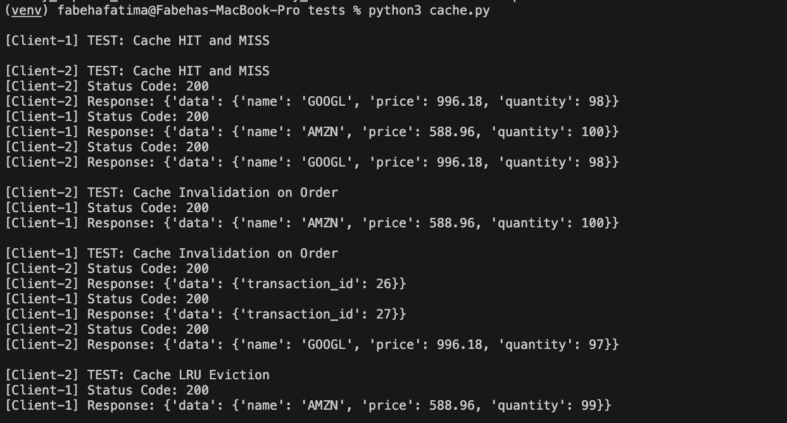
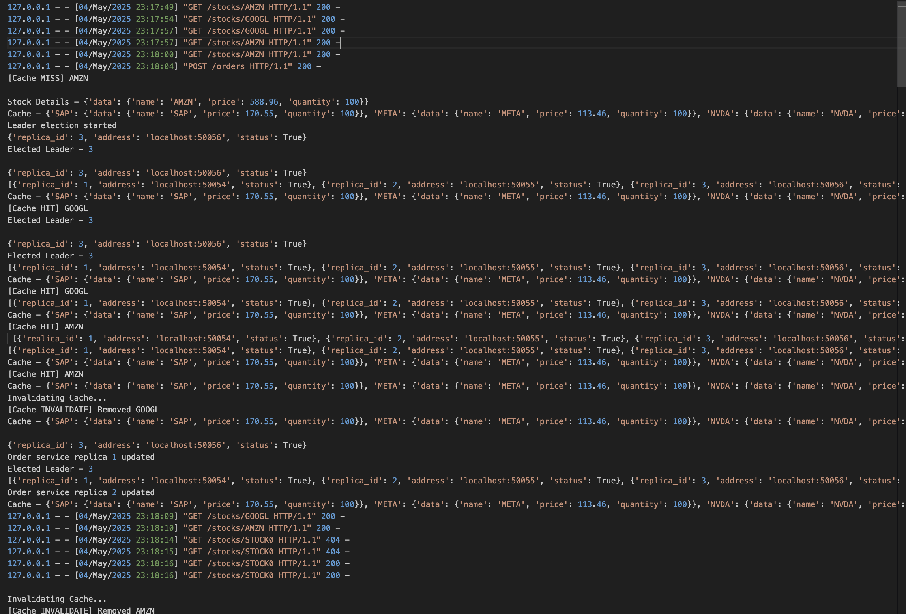
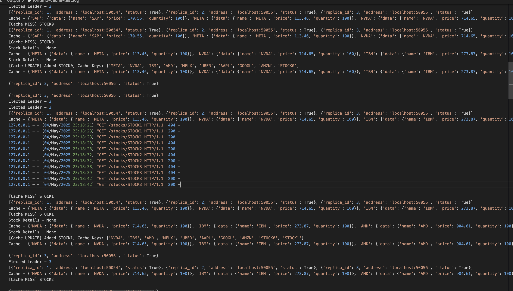
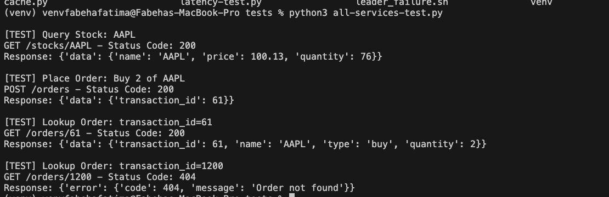

# Testing Report 

## Part 1: Cache Validation Tests  
We executed tests using a cache size of 10 to verify three critical behaviors: Cache MISS, Cache HIT and Cache INVALIDATE
The `tests/cache.py` simulated 2 concurrent clients testing a stock trading system’s frontend caching behavior. 

It uses the threading module to run the two clients (Client-1 and Client-2) in parallel, each performing a series of HTTP requests to test different cache-related scenarios. Specifically, it checks for cache hits and misses by sending repeated GET requests for the same stock, verifies cache invalidation by issuing a POST order after a lookup, and tests Least Recently Used (LRU) eviction by requesting more than 10 unique stock entries. Responses are logged with status codes and JSON payloads, and delays (time.sleep) simulate realistic timing between operations.

### Test Execution  
```bash
python3 tests/cache.py  
```  
*Cache test script output*  
  

### Key Functionality Verified  
1. **Cache Hit/Miss Behavior**  
   - First request: `[Cache MISS]` (fetched from catalog)  
   - Repeat request: `[Cache HIT]` (served from cache)  
   ```plaintext
   [Client-1] GET /stocks/GOOGL → [Cache MISS]
   [Client-1] GET /stocks/GOOGL → [Cache HIT]
   ```

2. **Order-Triggered Invalidation**  
   - Cache entry removed after trade order  
   ```plaintext
   [Client-2] POST /orders (buy GOOGL) → [Cache INVALIDATE]
   [Client-2] GET /stocks/GOOGL → [Cache MISS] 
   ```
   *Invalidation*  
     

3. **LRU Eviction Policy**  
   - Flooded cache with 12 stocks (exceeding 10-entry limit)  
   - Re-checked `STOCK0` → `[Cache MISS]` confirms eviction  
   ```plaintext
   [Client-1] GET /stocks/STOCK0 → [Cache MISS] (evicted)
   ```
   *Figure 4: Eviction test output*  
     

Full logs: `tests/output/frontend-cache-test.log`  
All tests were conducted via the provided `cache.py` script with randomized stock selections (AAPL, GOOGL, etc.) to ensure broad coverage  


- Cache operations (**HIT**/**MISS**/**INVALIDATE**) logged correctly  
- Eviction strictly followed LRU policy  

---  

## Test 2 : Validating all Services 
Here, we only see the implementation details of the whole application. 

The `all-services-test.py` script validates end-to-end functionality by testing:

1. Stock lookup → 2. Order placement → 3. Order verification  

  
*Test sequence showing successful stock query, order placement, and validation*

**Key Checks**:
- HTTP status codes (200 for success, 404 for invalid orders)
- Data consistency between order creation and lookup
- Error handling for invalid requests

Run with:  
```bash
python3 tests/all-services-test.py
```


Note: The remaining tests are added in [Evaluation.md](Evaluation.md) (i.e for Part 4 and Part 2 and 3 inside EC2)
