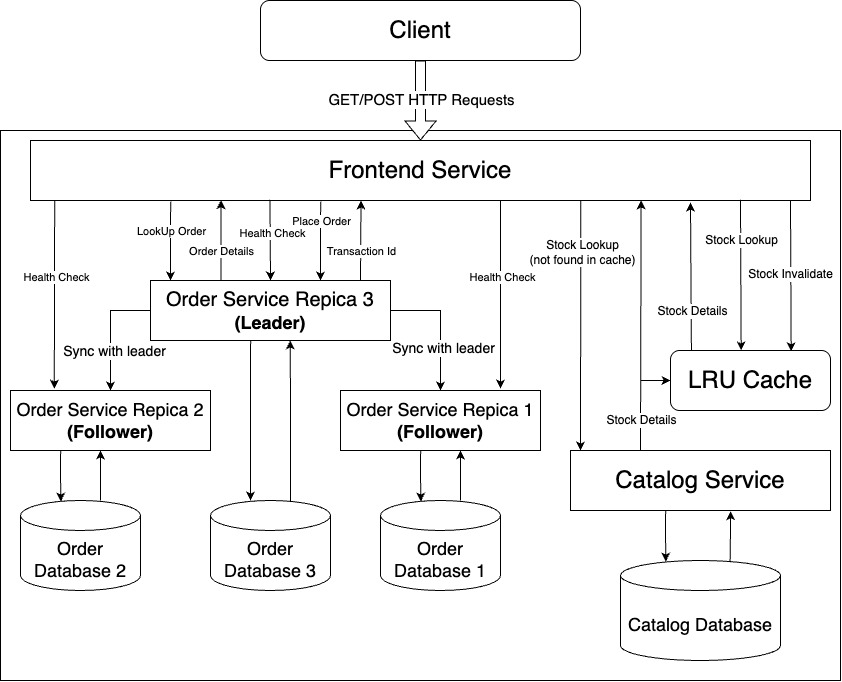

# Distributed Stock Trading System - Design Document

## 1. Introduction

This project implements a **Distributed Stock Trading System** composed of three microservices: **Catalog**, **Order**, and **Frontend**. These services are designed to manage stock data, process stock trades (buy/sell), and provide a user interface via **REST API**. The system leverages **gRPC** for efficient inter-service communication, and **threading** for concurrent handling of multiple requests.

The system integrates **caching** mechanisms to optimize data retrieval and **replication** strategies to maintain fault tolerance. The **Order** service supports **multi-replica synchronization**, ensuring consistency across service instances. Furthermore, **fault tolerance** is implemented to detect and recover from failures by **re-electing leaders** and **syncing followers** with the latest data.

---

## 2. System Architecture

### Frontend Service

**Overview:**  
The frontend service acts as the entry point for all client requests, handling **HTTP** requests for stock lookups and order placements. It then interacts with the **Catalog** and **Order** services using **gRPC** for actual processing.

**Technologies:**  
- **REST** protocol (using Python’s built-in HTTP server modules)
- **gRPC** (for communication with Catalog and Order services)  
- **ThreadPoolExecutor** (to manage concurrent sessions)

**Endpoints:**  
- `GET /stocks/<stock_name>` → Look up stock via Catalog Service
- `GET /orders/<order_id>` → Look up order via Order Service
- `POST /orders` → Send trade request to Order Service

**Concurrency Model**  
The frontend uses a thread pool to ensure that client sessions are handled concurrently and in an isolated manner, allowing better throughput and resource utilization.

---

### Catalog Service

**Overview:**  
Maintains the current inventory of available stocks. It supports operations like looking up a stock and updating stock quantities post-trade.

**gRPC Services:**  
- `LookupStock(stock_name)` → Returns price and quantity  
- `UpdateStock(stock_name, quantity_change)` → Modifies quantity based on trades

**Persistent Storage:**  
- `catalog_database.csv` → Used for storing and retrieving stock info persistently.

**Locking:** 
The service implements a custom **ReadWriteLock** to optimize performance—allowing multiple readers simultaneously but ensuring exclusive access for writers to prevent race conditions
It ensures that concurrent updates to stock quantities do not corrupt the CSV data.

**Concurrency Model**
The service follow a thread-per-request model, leveraging gRPC’s built-in threading, which is well-optimized for request-driven workloads.

---

### Order Service

**Overview:**  
The **Order** service is responsible for handling trade requests. It verifies stock availability, processes buy/sell orders, and logs the transactions.

**gRPC Services:**
- `PlaceOrder(stock_name, quantity, order_type)` → Completes the buy/sell transaction.
- `LookUpOrder(transaction_id)` → Retrieves order details for a given transaction ID.
- `SyncOrder(transaction_id, stock_name, quantity, order_type)` → Syncs order details between leader and followers.
- `BulkUpsert(data)` → Bulk upsert orders to replicas.
- `HealthCheck()` → Checks the health of the order service.

**Persistent Storage:**  
- `order_database.csv` → Stores each trade with a unique transaction number, stock name, type, and quantity.

**Transaction Number:**  
A unique incremental transaction ID is maintained and persisted.

**Locking:** 
The service implements a custom **ReadWriteLock** to optimize performance—allowing multiple readers simultaneously but ensuring exclusive access for writers to prevent race conditions
It ensures that concurrent updates to stock quantities do not corrupt the CSV data.

**Concurrency Model**
The service follow a thread-per-request model, leveraging gRPC’s built-in threading, which is well-optimized for request-driven workloads.

---

### Caching

**Overview:**
To optimize stock lookups, the **Frontend Service** employs a **global cache** for storing stock details. This reduces the need to query the **Catalog Service** repeatedly, improving overall system performance by providing quicker responses for frequently requested stock data.

**Cache Implementation:**
- **LRU Cache**: The cache is implemented using `OrderedDict` to maintain stock details. The cache size is limited (`max_size`), and the Least Recently Used (LRU) eviction policy is applied to ensure that only the most recently accessed data is retained in the cache.
- **Thread Safety**: Cache access is synchronized using a **ReadWriteLock** to ensure thread safety in the multi-threaded environment. This allows multiple threads to read the cache concurrently, while write operations are exclusive to prevent data corruption or race conditions.
- **Stock Details Management**: Stock details include `name`, `price`, and `quantity`, which are stored in the cache after the first retrieval from the **Catalog Service**. Each stock's details are updated or invalidated based on trade actions.
  
**Cache Operations:**
- **Cache Hit**: When a stock lookup request is made, if the requested stock is already in the cache, the **Frontend Service** will immediately return the cached data, ensuring faster response times.
- **Cache Miss**: If the requested stock is not found in the cache, the frontend queries the **Catalog Service** for the stock details. Once the data is retrieved, it is stored in the cache for future use and returned to the client.
- **Cache Eviction (LRU)**: If the cache exceeds the specified `max_size`, the Least Recently Used (LRU) item is evicted from the cache to make room for new entries. This ensures that the cache remains within its size limit and retains the most recently used data.
- **Cache Invalidations:**: When a trade (buy/sell) is completed, the cache is **invalidated** for the affected stock. The stock's details are removed from the cache .

---
### Replication

**Overview**
Three replicas of the **Order Service** are running, each connected to its own dedicated **Order Database**. These replicas ensure high availability and fault tolerance, with each one maintaining its own instance of order data. 

**Leader Election and Follower Assignment**
- **Health Check**: The leader election process begins with a health check of all available replicas. Each replica performs a health check to ensure that it is responsive and able to handle requests. This is done using a gRPC call to the **HealthCheck** endpoint on each replica.
- **Leader Selection**: Once the health check completes, the replica with highest replica id is selected as the **leader**. This leader is responsible for processing all incoming order requests and propagating updates to the follower replicas.
- **Follower Assignment**: Once the leader is elected, the remaining replicas are assigned as **followers**. Followers are replicas that remain passive and do not process new orders directly from clients. Their primary role is to replicate the data from the leader to ensure that all replicas maintain consistency. Followers stay in sync with the leader by continuously receiving updates whenever a new order is placed.

**Order Updates and Syncing**
- **Order Placement by Leader**: When a new order is placed, the **leader replica** first processes the order by interacting with the **Catalog Service** to verify stock availability and update stock quantities. After validating the order, the leader generates a new transaction ID and commits the order to its own **Order Database**.
- **Syncing to Followers**: After placing the order, the leader replica syncs the newly placed order with all follower replicas. This ensures that all replicas have the same order data and are consistent across the system.

---

### Fault Tolerance

**Overview**
Fault tolerance is implemented by ensuring that **replicas** are monitored for **health** and that any failed replicas are detected, leader is re-elected as necessary. Once the faulty replioca is live it is in sync with the **leader** to maintain data consistency across all replicas.

**Fault Tolerance Check**
- **Leader Health Check**: 
  - Upon every order update or transaction, the system performs a health check to verify if the current **leader replica** is active. This health check involves a gRPC call to the **leader's HealthCheck endpoint**. 
  - If the **leader** is found to be **inactive** or **unhealthy**, the system initiates a **leader election** process again. The system identifies the next available healthy replica as the new leader and re-assigns the followers accordingly.
  - The **status of the faulty replica** is set to **False**, indicating that it has failed and is no longer in a working state. It will be excluded from any further operations until it becomes healthy again.

- **Follower Health Check**: 
  - Similarly, each time an **order** is updated or processed by the leader, the **followers' health** is also checked.
  - If any follower is **inactive**, it is marked as **faulty**, and the system will attempt to re-sync the follower once it becomes healthy again.
  - The **status of the faulty followers** is updated to **False**, and they are excluded from the replication process until re-synced.

**Periodic Health Check**
- A **periodic health check** runs every 10 seconds to monitor the status of **faulty replicas**. If a **faulty replica** becomes **healthy** again, it is re-activated and automatically synchronized with the **leader** using the **BulkUpsert** function.
- The **BulkUpsert** function ensures that the recovering replica is updated with the latest orders from the **leader's Order Database**, restoring data consistency.

---

### Inter-Service Communication

All communication between services is done using **gRPC** on predefined ports. The frontend calls Catalog and Order services over gRPC after receiving **REST API** requests from clients.

**Ports and Connections:**  
- Frontend: REST API on 8081  
- Catalog: gRPC on 50052  
- Order 1: gRPC on 50054
- Order 2: gRPC on 50055
- Order 3: gRPC on 50056

---

### Architecture Diagram 

## 3. Design Decisions

### Caching Design

**Why a Cache?**  
The global cache is introduced to reduce the load on the **Catalog Service** and improve the response time for frequently requested stock data.

**How It Works:**
- **LRU Eviction**: To prevent the cache from growing indefinitely, we use a Least Recently Used (LRU) eviction strategy.
- **Thread Safety**: A **ReadWriteLock** ensures that multiple threads can read the cache simultaneously without interference, while write operations are exclusive to avoid data corruption.

### Replica Sync and Leader Election

**Why Leader Election?**  
Leader election ensures that only one replica handles the critical updates to maintain data consistency. Other replicas (followers) sync with the leader periodically.

**How It Works:**
- **Sorting by Replica ID**: The system sorts replicas by their `replica_id` to choose the one with the highest ID as the leader.
- **Follower Sync**: Once a new order is placed or updated, the leader pushes the changes to the followers using **Bulk Upsert**.

### Fault Tolerance

**Why Fault Tolerance?**  
Ensuring the system can handle **leader failures**, **replica failures**, and **network issues** is crucial for maintaining system availability and consistency.

**How It Works:**
- **Leader Re-election**: If the leader is unresponsive, the frontend service will attempt to elect a new leader from the healthy replicas.
- **Sync After Recovery**: Once a replica becomes healthy, the frontend will sync it with the leader’s latest state to bring it up to date.

### ThreadPool

- **Why**: To handle concurrent requests efficiently without spawning threads manually.
- **How**: Frontend uses ThreadPoolExecutor to manage sessions.

### gRPC Communication

- **Why gRPC**: 
gRPC is a high-performance, open-source universal RPC (Remote Procedure Call) framework that uses HTTP/2 for transport and Protocol Buffers (Protobuf) for serializing structured data.

- **Benefits**: Strong typing via Protocol Buffers, faster serialization than JSON.

### Lock Implementation

- To ensure data consistency in a concurrent environment, especially when multiple threads are performing read and write operations on the shared CSV files (i.e., `catalog_database.csv` and `order_database.csv`), we implement a custom read-write lock mechanism. This prevents race conditions and ensures that multiple readers can access the data simultaneously, but writes are exclusive, meaning no reads or writes can happen while a write is in progress.

#### How it Works

- `acquire_read()`
Multiple threads can safely acquire the read lock simultaneously. It increments the internal reader count.

- `release_read()`
Decreases the reader count and notifies waiting writers if no readers remain.

- `acquire_write()`
Writers wait until there are no active readers. This ensures exclusive access for writing.

-  `release_write()`
Releases the underlying lock so that other readers or writers can proceed.

This locking strategy is crucial for:

- Ensuring that **readers do not block each other**, increasing performance for read-heavy workloads.
- Preventing **writes from interleaving with reads**, maintaining data integrity in the persistent CSV storage.
- Coordinating access across multiple threads spawned from the thread pool handling client requests.

---

## 4. Conclusion

This system successfully demonstrates a robust, scalable, and fault-tolerant distributed stock trading system that efficiently handles stock lookups, order processing, and synchronization across multiple replicas. By utilizing gRPC for communication, LRU caching for stock data, and a custom ReadWriteLock for thread safety, the system ensures high performance, low latency, and data consistency. The leader election and replication mechanisms enable efficient order syncing and management across multiple replicas, while the fault tolerance strategy ensures that the system remains resilient to failures. The periodic health checks and automatic syncing of recovering replicas guarantee that the system remains in a consistent state, minimizing downtime and ensuring high availability. This design provides a strong foundation for a reliable and scalable distributed stock trading system capable of handling real-world operational challenges.

## 5. Use of ChatGPT
ChatGPT assisted us in determining the optimal timing for updating followers in the replica system. We were uncertain whether to update the followers before or after sending the HTTP response. ChatGPT explained the trade-offs and ultimately we decided to update the followers before the response, as it would make the whole process atomic.
